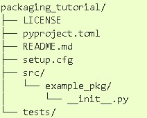

# artifacts-demo

### For package setup

---

Directory Structure :

  

setup .py sample [here](./setup.py)

License sample [here](./LICENSE)

----

## Generating Distributions

`python setup.py sdist` to generate builds and dist folder

### User twine module to upload your package to pypi

`pip install twine` after installation do `twine upload dist/*`

It will ask for username and password for pypi account.

If you dont have an account in pypi then [register here](https://pypi.org/account/register/)

